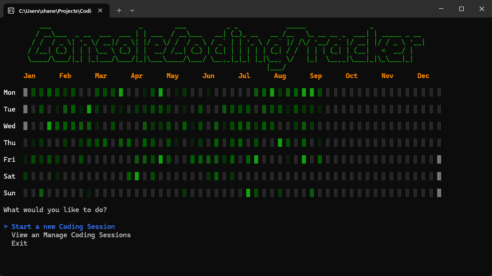
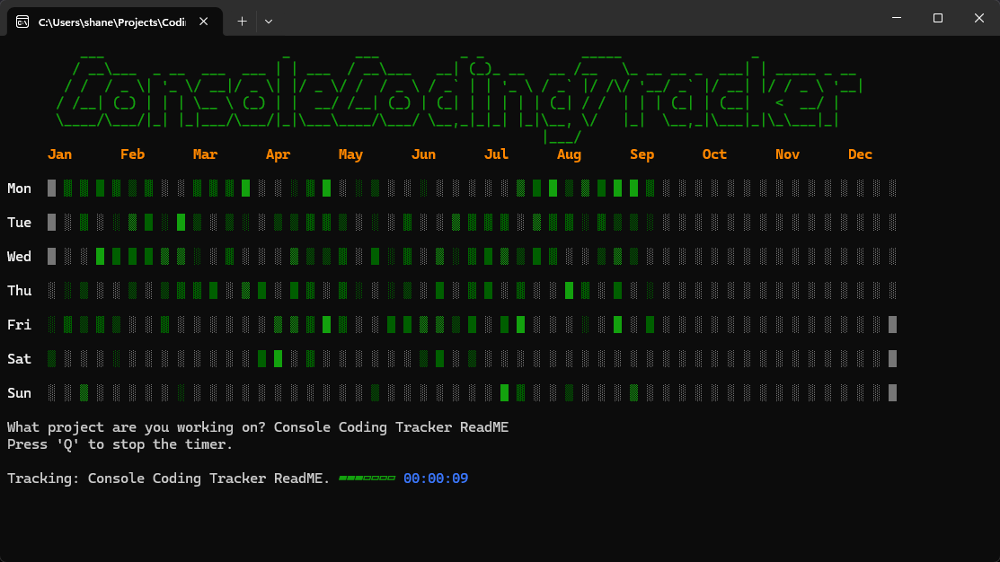
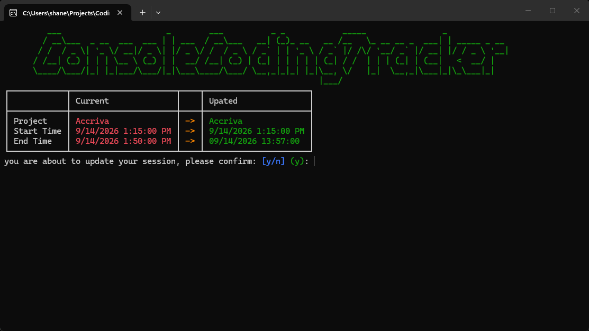

# Console Coding Tracker

Console Coding Tracker is a C# console application for tracking coding sessions
and visualising coding activity throughout the year

The project was built as a learning project to practice C#, .NET, SQLite, Dapper, LINQ,
Software architecture and unit testing.

One of the main features is a GitHub-inspired Coding Calendar that provides
a visual representation of daily coding activity.

## Screenshots

### Coding Calendar

The Coding Calendar provides a visual representation of coding activity
throughout the year. Each day displays an activity level based on the amount of time spent coding.

### Coding Sessions

Coding sessions can be created, viewed, edited and deleted.
Sessions can also be tracked using the Session tracker.

## Futures 

- Create, edit and delete coding sessions
- Record project, start time, end time and duration
- Filter coding sessions by day, week, month and year
- Sort sessions in ascending or descending order
- Visualise yearly coding activity with the Coding Calendar
- Calculate coding activity across sessions that span multiple days
- Store coding session data in SQLite
- Validate user input
- Unit tests using xUnit
- Interactive console interface using Spectre.Console

## Technologies

- **C# / .NET**
- **SQLite**
- **Dapper**
- **Spectre.Console**
- **xUnit**
- **LINQ**

## Architecture

- **UI** — Handles user interaction and presentation using Spectre.Console.
- **Controllers** — Coordinates application flow between the UI, services and repositories.
- **Services** — Contains application and business logic such as validation and calendar generation.
- **Repositories** — Handles database operations using Dapper and SQLite.
- **Entities** — Contains the application's data models.
- **Configuration** — Handles application configuration such as the database connection string.
- 
## Testing

Unit tests are written using xUnit.

Current tests cover:

- Date Validation
- Coding Calendar Activity Symbols and Colors

## Getting Started

### Prerequisites

- .NET SDK
- Visual Studio or another C#/.NET development environment

### Running the application

1. Clone the repository.
2. Open `CodingTracker.sln` in Visual Studio.
3. Restore the NuGet packages.
4. Build the solution.
5. Run the `CodingTracker` project.

The application creates the required database directory and SQLite database when required.

## What I Learned

This project gave me practical experience with:

- Structuring a C# application using separation of concerns
- Working with SQLite and SQL
- Using Dapper for database access
- Writing parameterised SQL queries
- Working with LINQ
- Handling dates, times and date ranges
- Designing console interfaces with Spectre.Console
- Separating validation and business logic from UI code
- Writing unit tests with xUnit
- Refactoring code to make individual pieces easier to test

## Future Improvements

Some ideas for future development include:

- Add additional filtering options
- Improve database error handling
- Add more comprehensive unit and integration tests
- Add project-specific coding statistics

